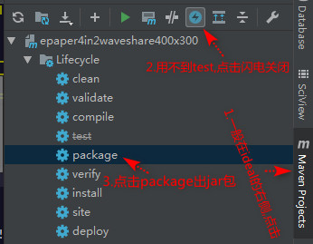
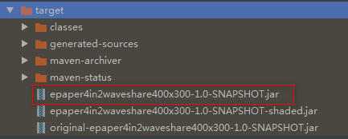

# 结果展示
1. 我做的这个很简陋，需要插电，自己玩玩还行，效果见下：

# 实现说明
我一如既往的使用树莓派+java实现。关于墨水屏和驱动板，我淘宝下的单见以下截图，需要的可以自己搜。

接线方式，参考我之前的这篇内容《[树莓派 java 驱动 微雪 墨水屏 epaper](https://blog.csdn.net/chenqide163/article/details/107010984)》的“接线”章节
代码实现说明（代码已经上传至github，点击 [这里]() 可以进入代码）：
1. com.chenqi.ap.OperateAp#getRaspiIP -> 这个方法，可以获取到树莓派当前的ip，进入代码可以看到，树莓派的ip是通过java执行指令：hostname -I | cut -d  获得。
2. com.chenqi.weather.sojson.SojsonWeatherService#getWeatherByCityId -> 这个方法，可以获取到国内任何地区的天气情况，入参传入这个地区的编号即可，我传的是101190101（南京市的编号）。获取天气预报的方式，在我之前的内容[树莓派 java 驱动 lcd tft spi 1.8寸 ST7735S 天气 预报](https://blog.csdn.net/chenqide163/article/details/107703648)有详细讲解
3. com.chenqi.waveshare.for4in2.GetEpaperImg#getWeatherImg -> 将获取到的树莓派ip，和天气预报，做图。这里我指定使用微软雅黑的字体，树莓派默认是不带这个字体的，需要安装该字体，安装方式见我的这篇内容[树莓派 java ssd1306 12864oled 任意字体 任意文字](https://blog.csdn.net/chenqide163/article/details/106933858)。不装微软雅黑这个字体也没有问题，只不过使用树莓派的默认字体显示中文而已。可能就是排版上有点不同
4. com.chenqi.waveshare.for4in2.GetEpaperImg#main -> 做图完成后，可以通过这个方法，输出图片，以便快速改动图片布局等，比如，输出的图形见下：
    
5. com.chenqi.waveshare.for4in2.Epaper4in2DrawImg#displayImgWith4GrayScale -> 将以上getWeatherImg方法生成的对象，传入当前方法，则可以在墨水屏上显示生成的图片。
# 代码打包即执行
1. 代码打包的时候，ideal编辑器提示1.5版本的jdk不支持xx的报错
    1. 这里需要改动一下maven的路径，ideal默认使用自带的maven，估计这个自带maven的jdk版本没配置好，这里改动一下即可：
         
    2. 改动为自己装的maven路径（User settings file），Local repository会自动联想出来，不专门改动是没关系的。然后点击**apply**和**OK**即可
        
2. 出包
    
3. 将生成的包（epaper4in2waveshare400x300-1.0-SNAPSHOT.jar），通过ftp传入到树莓派任意目录下，如树莓派的家目录：/home/pi
    
4. 在命令行中，进入到jar包所在的目录，jar我放在树莓派用户的家目录下，cd /home/pi 即可。
5. 使用指令java -jar epaper4in2waveshare400x300-1.0-SNAPSHOT.jar即可运行，在墨水屏上显示对应的图像。
6. 配置树莓派开机自动运行该jar包
    1. vi /etc/rc.local
    2. 在rc.local文件的最下方（但是要在exit 0语句之前），加入以下脚本（jar的路径请按需改动）：
    ``` shell
        java -jar /home/pi/epaper4in2waveshare400x300-1.0-SNAPSHOT.jar
    ```
    3. 重启之后，jar就会自动运行了